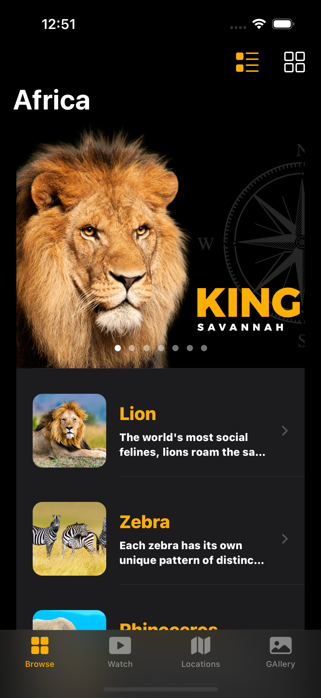
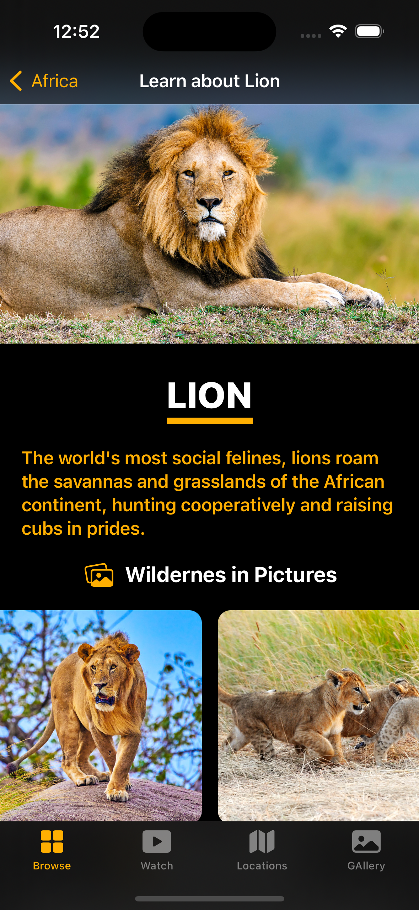
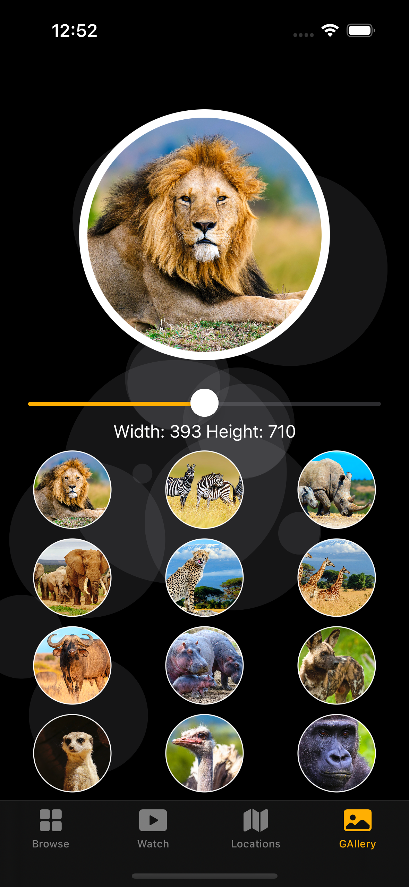

# Africa App
### Setup
This project was implemented using XCode 14 and iOS 15 deployment target.

## Summary

### LEARNING OBJECTIVES

#### - JSON with Swift (basic and advanced approach),
#### - Grid Layouts (basic and advanced approach with a cool feature),
#### - MapKit Integration (basic and advanced approach with another cool feature),
#### - Video Player (new SwiftUI 2 feature)
#### - Launch Screen (new way)
#### - Swift programming concept: Extension,
#### - Swift programming concept: Generics,
#### - Prototype the whole application with SwiftUI 2 framework
#### - Design and improve the User Experience,
#### - iMessage Sticker Pack,
#### - Bring the full iPadOS app to macOS 11 Big Sur using Mac Catalyst technology,
#### - Learn what is Pseudocode and why it is important,
#### - What is a Bundle and Extension in app development and how to use them, etc.

# App screens

<table style="width:100%; border: 0px solid">
  <tr>
    <td></td>
    <td></td>
    <td></td>
  </tr>
   <tr>
    <td></td>
    <td></td>
    <td></td>
   </tr>
</table>

### End
