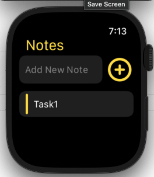
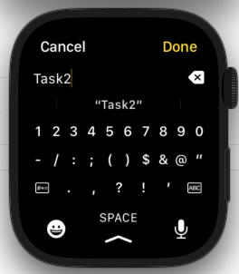
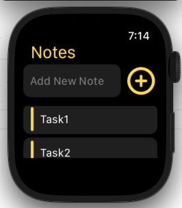

# Notes App

We are going to develop a modern Notes application for Apple watches.
By creating this app, we will learn how to develop a standalone watch extension using the watchOS and SwiftUI frameworks together.

### Setup
This project was implemented using XCode 14 and iOS 15 deployment target.

## Summary

### LEARNING OBJECTIVES

#### - Get familiar with the basics of the watchOS framework

#### - Create multiple views and navigate between these views

#### - Develop a standalone Apple Watch application with SwiftUI

#### - Permanently save notes and store data on Apple Watch

#### - Show a list of notes on Apple Watch

#### - Select and delete notes from Apple Watch

#### - Show SwiftUI views conditionally

#### - Create and utilize uniform design language across pages

#### - Use Swift's Codable protocol for serialization

#### - Test a Watch app fullscreen in Simulator or on a device

#### - Develop a new feature using SwiftUI's Slider element

#### - Dreate custom user interface elements

#### - Add icons and asset files to a Watch extension

#### - Use the input tools: Dictate, Scribble, Emoji, Type

# App screens

<table style="width:100%; border: 0px solid">
  <tr>
    <td></td>
    <td></td>
    <td></td>
  </tr>
   <tr>
    <td></td>
  </tr
</table>

### End
