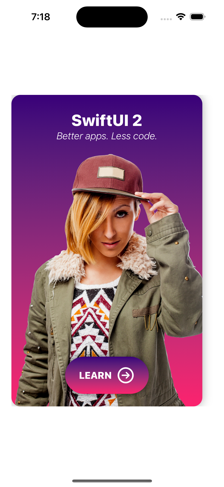
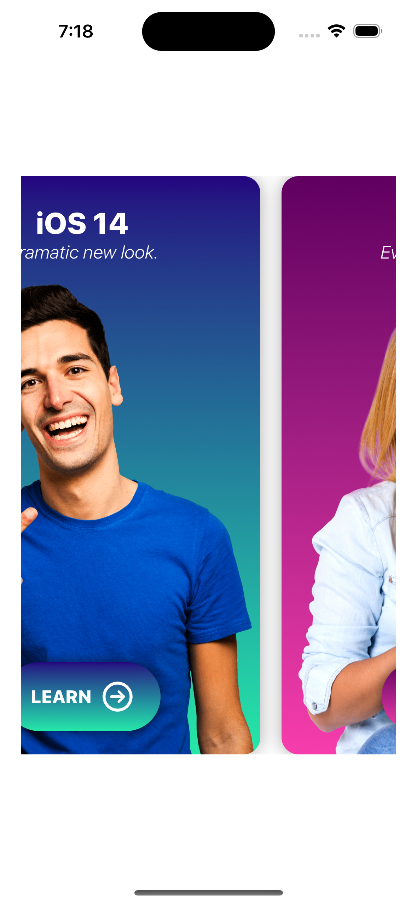

# Developers App

We are going to develop an app with carrussel compnent showing developers portraits showing some advices in a alert.

### Setup
This project was implemented using XCode 14 and iOS 15 deployment target.

## Summary

### LEARNING OBJECTIVES

#### - Set up a new iOS 13 project

#### - Create a launch screen

#### - Add icons for the app

#### - Create a card layout with SwiftUI

#### - Load different information from a data file

#### - Play sounds

#### - Animate user interface elements with SwiftUI

#### - Create a haptic feedback feature

#### - Show alerts with SwiftUI

#### - Create stickers without writing any code

# App screens

<table style="width:100%; border: 0px solid">
  <tr>
    <td></td>
    <td></td>
    <td></td>
  </tr>
</table>

### End
