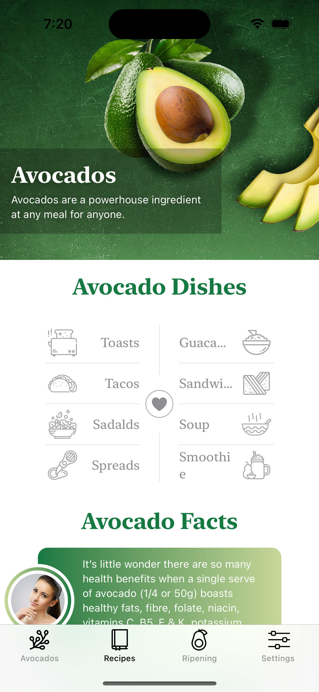
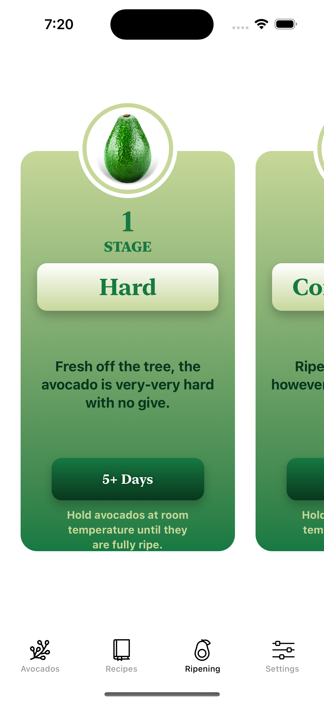
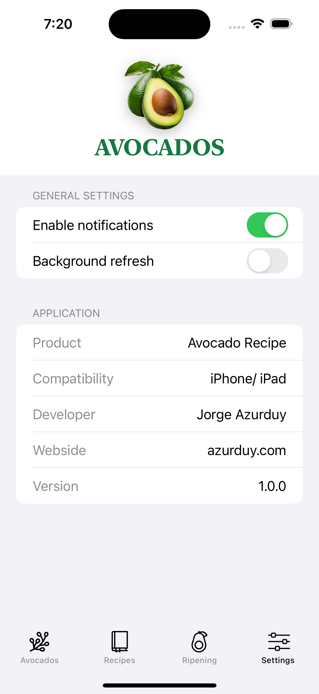

# Avocado App

We create an eye-catchy layout in SwiftUI? In the second project, you will learn all about views in SwiftUI!
We are going to build an Avocado Recipe iOS 13 app for iPhone and iPad.

### Setup
This project was implemented using XCode 14 and iOS 15 deployment target.

## Summary

### LEARNING OBJECTIVES

#### - Create scroll views inside another scroll view,

#### - Why we should use custom View Modifiers (avoiding code repetition)

#### - Build a tab view with custom icons,

#### - Master the vertical and horizontal layout design,

#### - Round the corners of a view and create a unique shape form,

#### - Support the Light/Dark modes in SwiftUI,

#### - Create micro animation and enhance the UI,

#### - Gentle introduction into forms in SwiftUI

# App screens

<table style="width:100%; border: 0px solid">
  <tr>
    <td></td>
    <td></td>
    <td></td>
  </tr>
  <tr>
    <td></td>
    <td></td>
    <td></td>
  </tr>
</table>

### End
