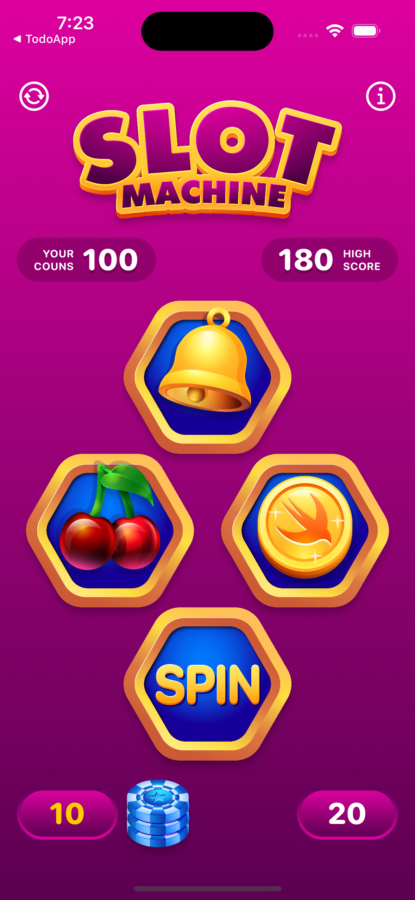
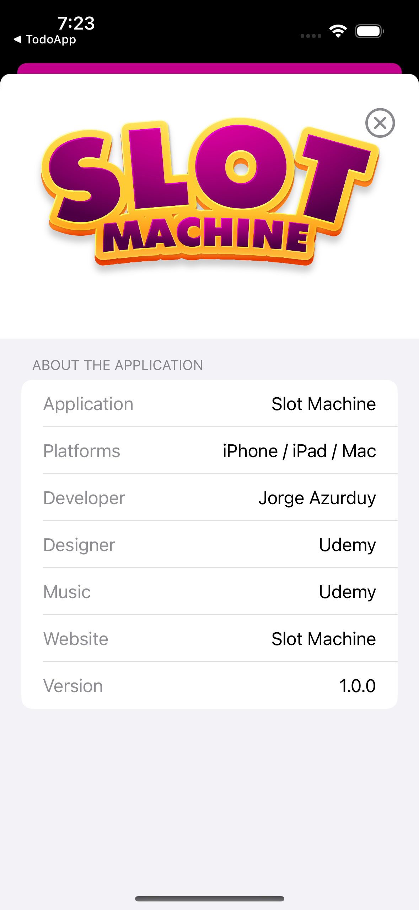
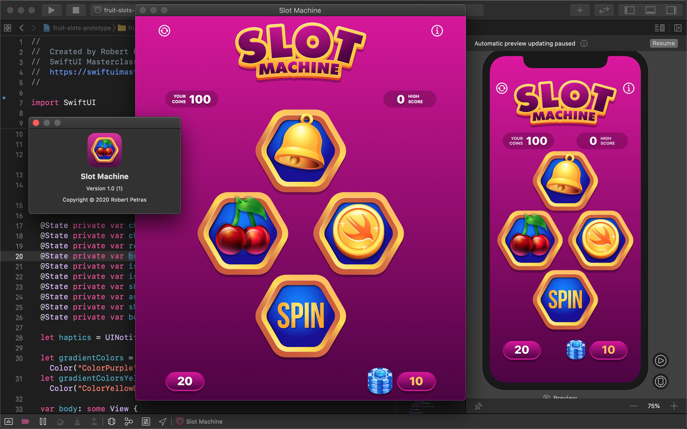

# Slot Machine App

Start building a native Mac app from your current iPad app.
With Mac Catalyst, your apps share the same project and source code so you can efficiently convert your iPad app’s desktop-class features, and add more just for Mac.

### Setup
This project was implemented using XCode 14 and iOS 15 deployment target.

## Summary

### LEARNING OBJECTIVES

#### - Build a fun Slot Machine minigame

#### - Bild an iPhone and iPad app with outstanding graphics.

#### - Store data with User Defaults.

#### - Create a macOS application with Mac Catalyst.

# App screens

<table style="width:100%; border: 0px solid">
  <tr>
    <td></td>
    <td></td>
    <td></td>
  </tr>
  <tr>
    <td colspan="3"></td>
    <td></td>
    <td></td>
  </tr>
</table>

### End
