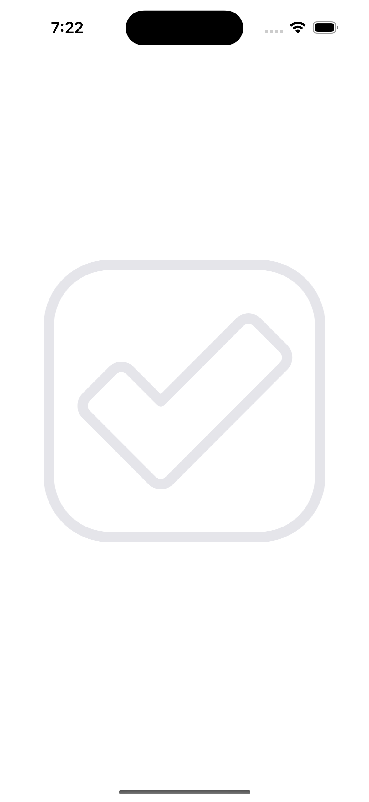
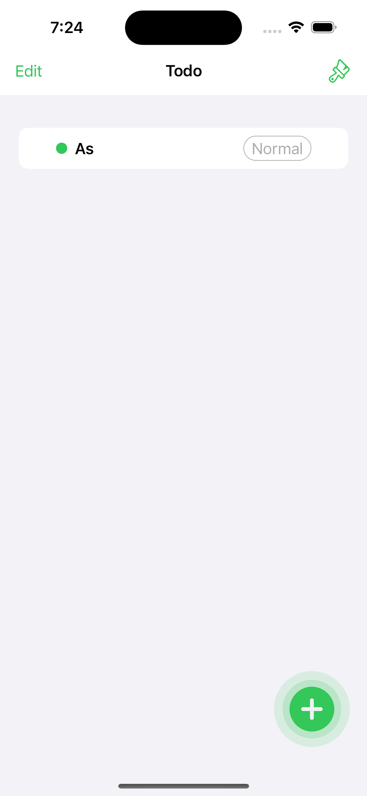
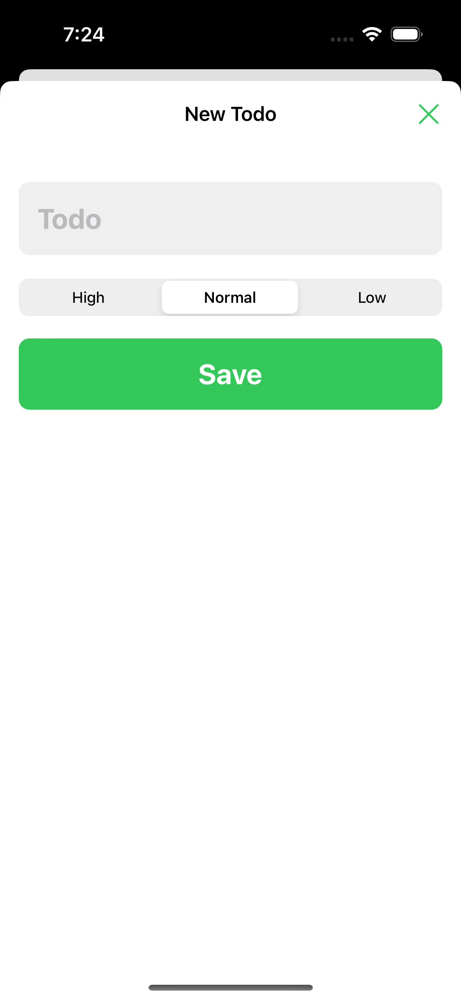
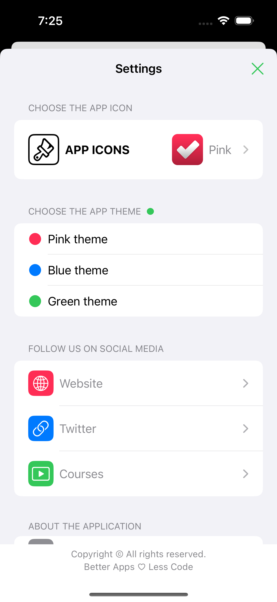

# Todo App

Simple Todo app to add task to my main list.

### Setup
This project was implemented using XCode 14 and iOS 15 deployment target.

## Summary

### LEARNING OBJECTIVES
#### - Build an impressive Todo iOS and iPadOS application

#### - Save data permanently to the local database with Core Data

#### - Add priority for the Todo items

#### - Delete Todo items

#### - Create an outstanding Home view with custom illustrations and quotes

#### - Build a complex Settings view

#### - Develop a new feature: Alternative Icons

#### - Develop a new feature: App Color Themes

#### - Open external links like Web pages, Twitter app, etc.

#### - Create a subtle animation and enhance the UX

#### - Support Dark/Light user interface

# App screens

<table style="width:100%; border: 0px solid">
  <tr>
    <td></td>
    <td></td>
    <td></td>
  </tr>
  <tr>
    <td></td>
    <td></td>
    <td></td>
  </tr>
</table>

### End
