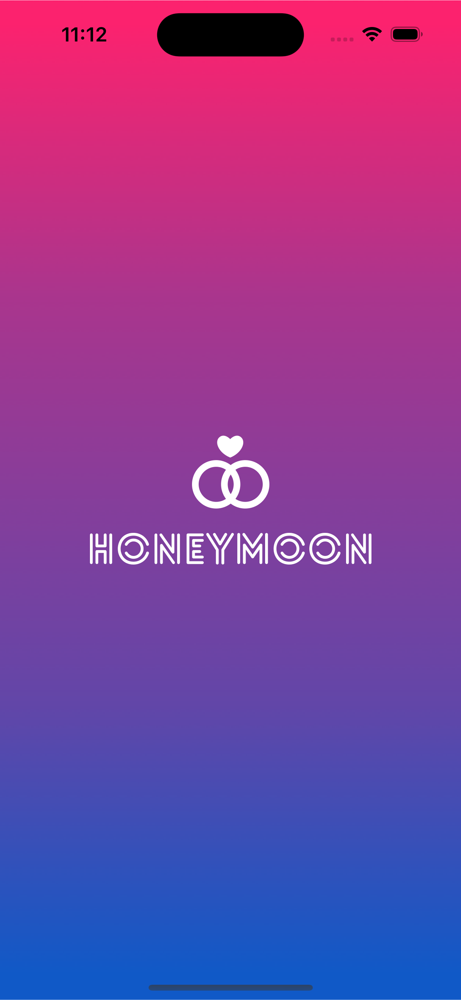

# HoneyMoon App

 we’re going to develop an awesome iOS/iPadOS app with SwiftUI drag gestures in Xcode.

### Setup
This project was implemented using XCode 14 and iOS 15 deployment target.

## Summary

### LEARNING OBJECTIVES

#### - St up the Honeymoon app, an iOS/iPadOS 13 project in Xcode 11.
#### - Create a Launch Screen for the project
#### - Build up the layout of the individual Honeymoon Card view
#### - Develop the Header layout of the Honeymoon App with SwiftUI
#### - Develop the Footer layout of the Honeymoon App with SwiftUI
#### - Create reusable components and write less code with SwiftUI
#### - Create a new view for the guides of Honeymoon App
#### - Binding work with SwiftUI
#### - Show views with Binding and dismiss view with Environmental objects
#### - Create a new view for the credits and app info
#### - Show views with Binding and dismiss view with Environmental objects (exercise)
#### - Implement the card deck with a computed property
#### - Implement the Swiping Motion with SwiftUI
#### - Display the Heart and X-mark symbols during the swiping
#### - Remove and insert the cards
#### - Enhancing the animation with custom transitions with SwiftUI
#### - Implementing haptic feedback (success) and playing sound effects

# App screens

<table style="width:100%; border: 0px solid">
  <tr>
    <td></td>
    <td></td>
    <td></td>
  </tr>
  <tr>
    <td></td>
    <td></td>
    <td></td>
  </tr>
  <tr>
    <td></td>
    <td></td>
    <td></td>
  </tr>
</table>

### End