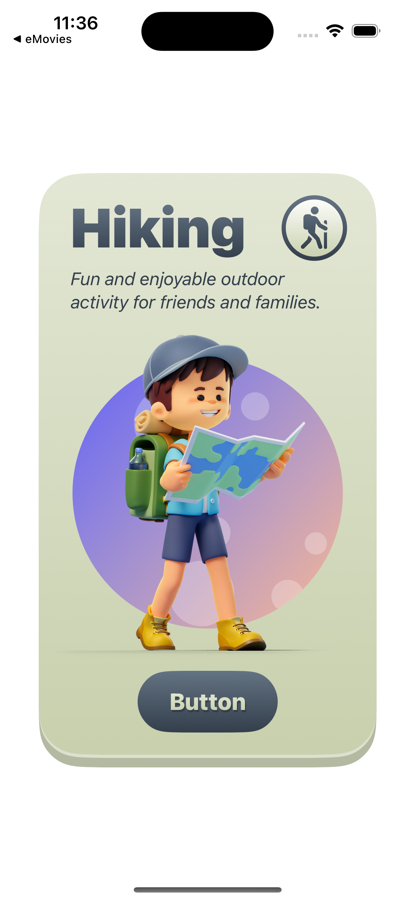
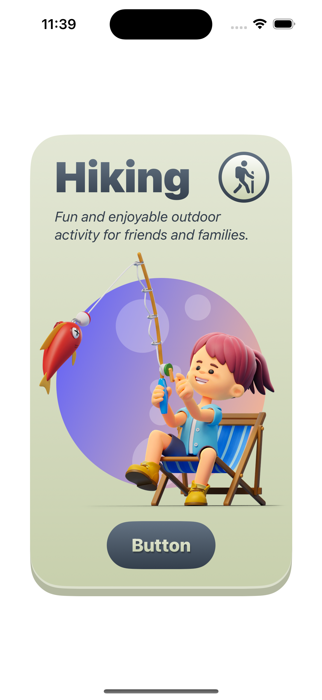
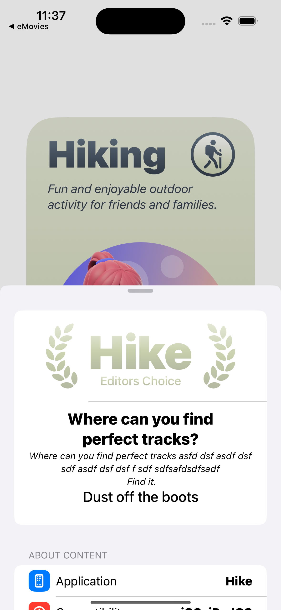
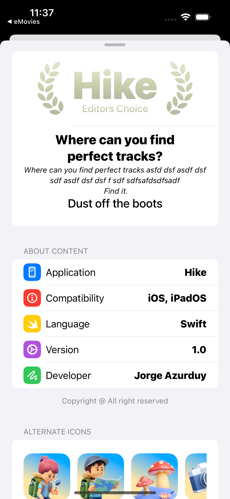

# Hike App

 we’re going to develop an awesome iOS/iPadOS app with SwiftUI in Xcode.

### Setup
This project was implemented using XCode 14 and iOS 15 deployment target.

## Summary

### LEARNING OBJECTIVES

#### - St up the Honeymoon app, an iOS/iPadOS 13 project in Xcode 11.
#### - SwiftUI Layout Containers
#### - Alternate App Icons
#### - Gradient and Motion Animation
#### - SF Symbols
#### - iPhone and iPad App Icon

# App screens

<table style="width:100%; border: 0px solid">
  <tr>
    <td></td>
    <td></td>
    <td></td>
  </tr>
  <tr>
    <td></td>
    <td></td>
    <td></td>
  </tr>
</table>

### End