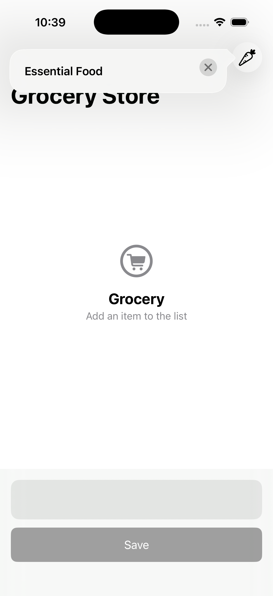
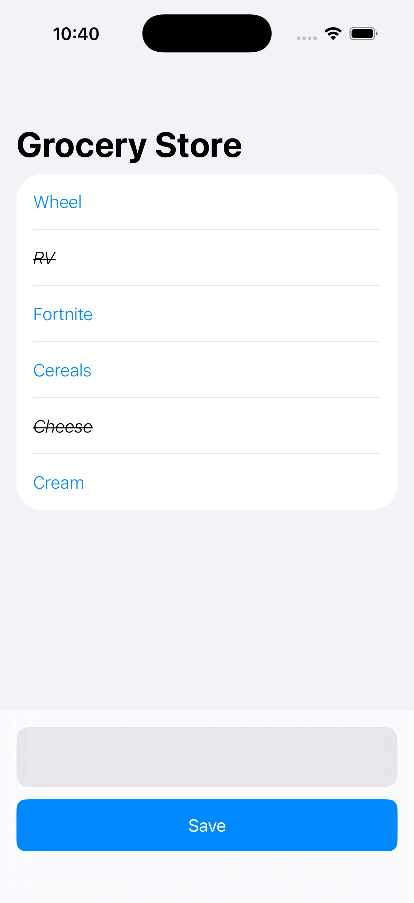

# GroceryList App

 We’re going to develop an awesome iOS/iPadOS app with SwiftUI in Xcode.

### Setup
This project was implemented using XCode 26 and iOS 17 deployment target.

## Summary

### LEARNING OBJECTIVES

#### - Creating Data Model.
#### - Previewing Sample Data.
#### - Deleteing data.
#### - Updating data.
#### - Saving data.
#### - Tipkit Integration

# App screens

<table style="width:100%; border: 0px solid">
  <tr>
    <td></td>
    <td></td>
    <td></td>
  </tr>
</table>

### End

