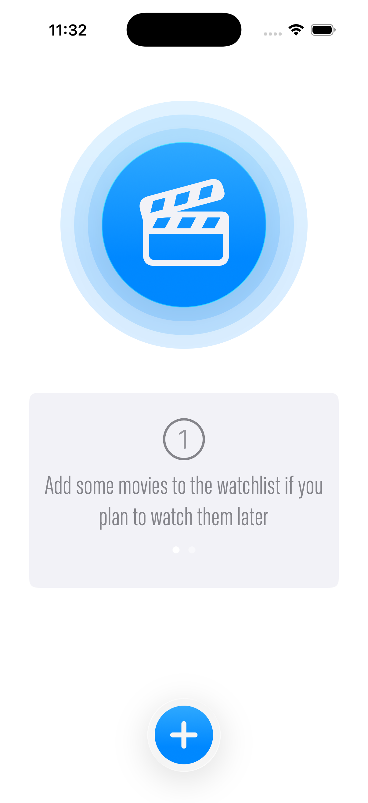
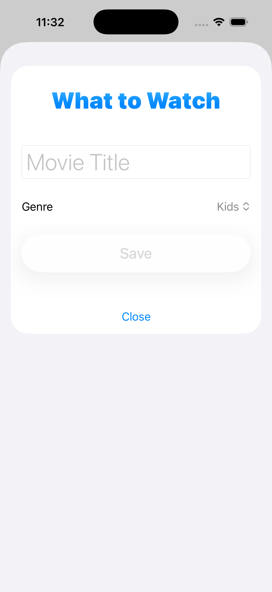
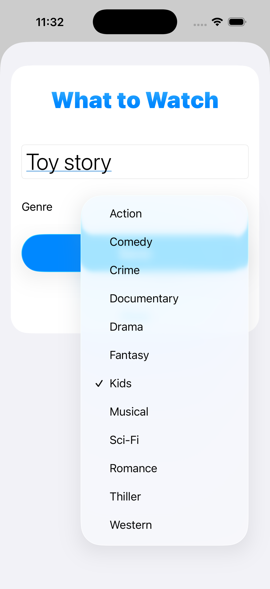
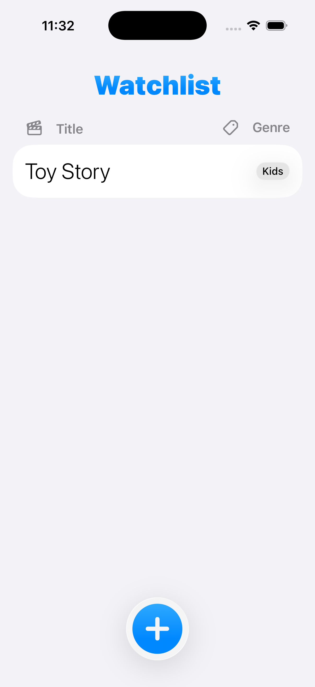

# WatchList App

 We’re going to develop an awesome iOS/iPadOS app with SwiftUI in Xcode.

### Setup
This project was implemented using XCode 26 and iOS 17 deployment target.

## Summary

### LEARNING OBJECTIVES

#### - Creating Data Model with SwiftData.
#### - Previewing Sample Data.
#### - Deleteing data.
#### - Updating data.
#### - Saving data.
#### - SwiftUI animation and effects.
#### - SwiftUI form implementation.
#### - List gesture to delete rows.

# App screens

<table style="width:100%; border: 0px solid">
  <tr>
    <td></td>
    <td></td>
    <td></td>
  </tr>
  <tr>
    <td></td>
    <td></td>
    <td></td>
  </tr>
</table>

### End

