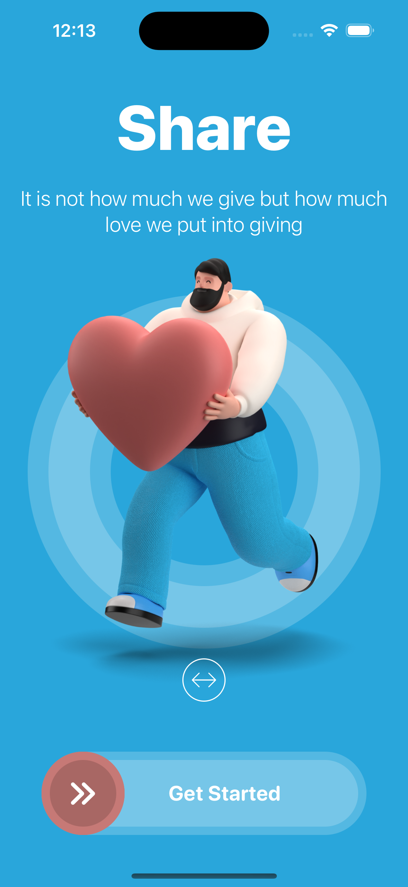
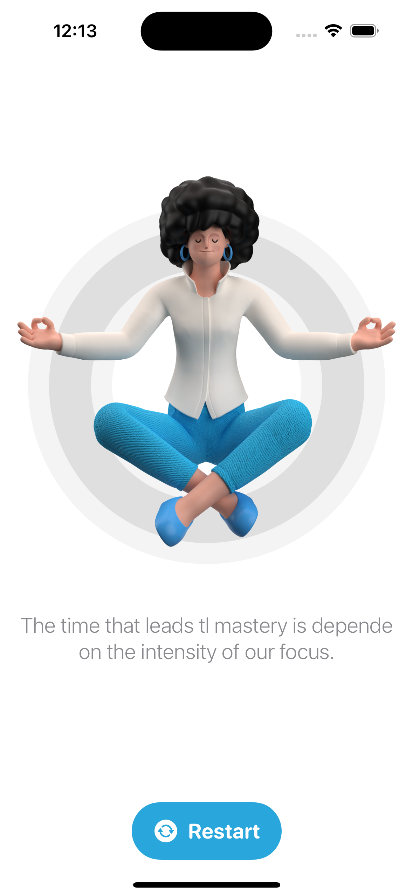

### Setup
This project was implemented using XCode 14 and iOS 15 deployment target.

## Summary

# ADVANCED APP DESIGN
The main goal of this mini project is to inspire you on what we can accomplish with the SwiftUI framework.

# COMPLEX SWIFTUI GESTURES
We will create such a custom button with complex gestures that we can not find in Apple’s stock user interface library.

# PARALLAX EFFECT
By using multiple movements in the opposite direction (parallax effect) we can add depth to this amazing onboarding screen.

# App screens

 

### End
