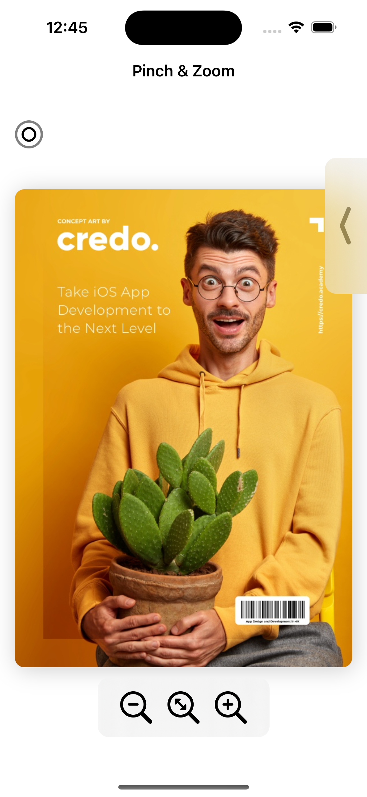
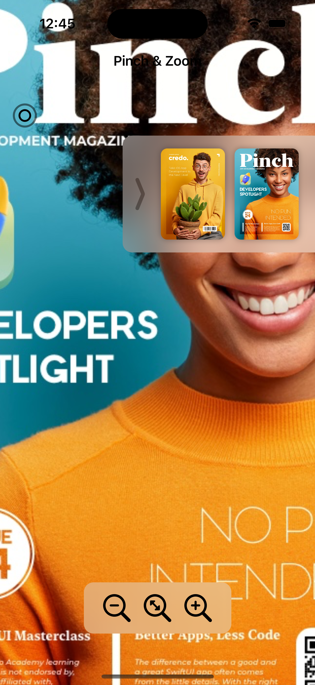

### Setup
This project was implemented using XCode 14 and iOS 15 deployment target.

## Summary

#### - Pinch & Zoom App
#### - SwiftUI Gestures
#### - SwiftUI Materials
#### - SF Symbols
#### - iPhone and iPad App Icon

# App screens

<table style="width:100%" border="0">
  <tr>
    <td></td>
    <td></td>
    <td></td>
  </tr>
</table>

<!--  -->
<!--   -->

### End
