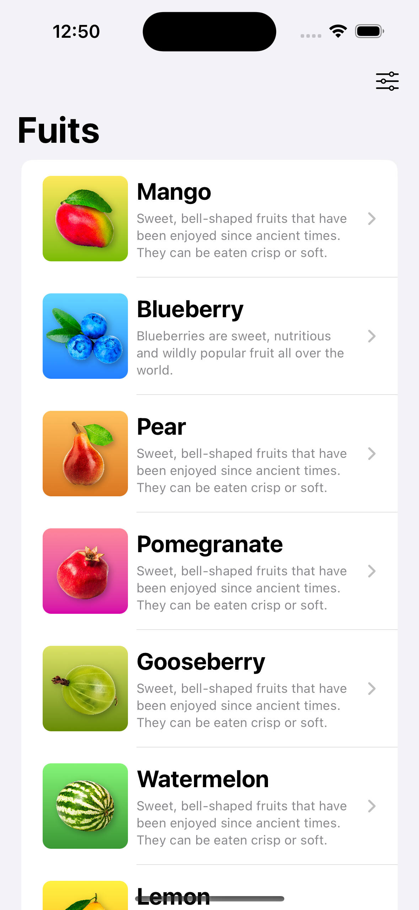
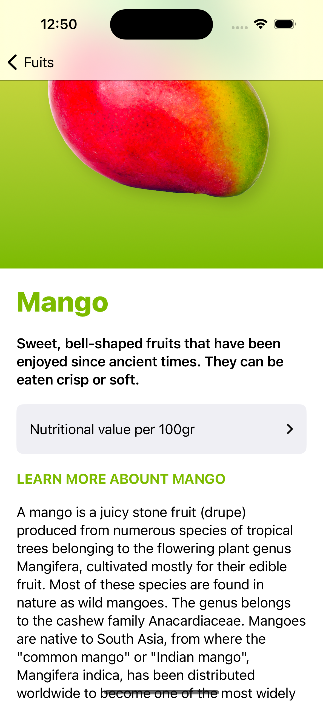
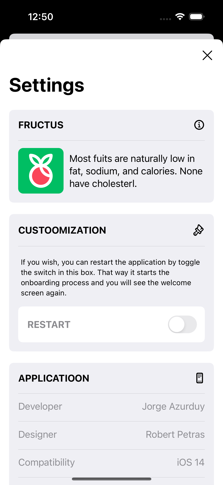

# Fructus App
### Setup
This project was implemented using XCode 14 and iOS 15 deployment target.

## Summary

### LEARNING OBJECTIVES

#### - Set up a new iOS 14 project with the new SwiftUI App Life Cycle.
#### - Develop a unique Onboarding screen
#### - Use the new AppStorage in SwiftUI 2.0
#### - Save and load data using UserDefaults
#### - Create custom Views with SwiftUI
#### - Retrieve local data using Structs in Swift 5.3
#### - Display multiple Views automatically with ForEach loop
#### - Use scroll view, horizontal view, vertical view containers
#### - Create an outstanding Settings view
#### - Add Icons to the App
#### - Use the improved Canvas and Previews in Xcode 12
#### - Test the iOS 14 app in Xcode Simulator

# App screens

<table style="width:100%; border: 0px solid">
  <tr>
    <td></td>
    <td></td>
    <td></td>
  </tr>
   <tr>
    <td></td>
   </tr>
</table>

### End
