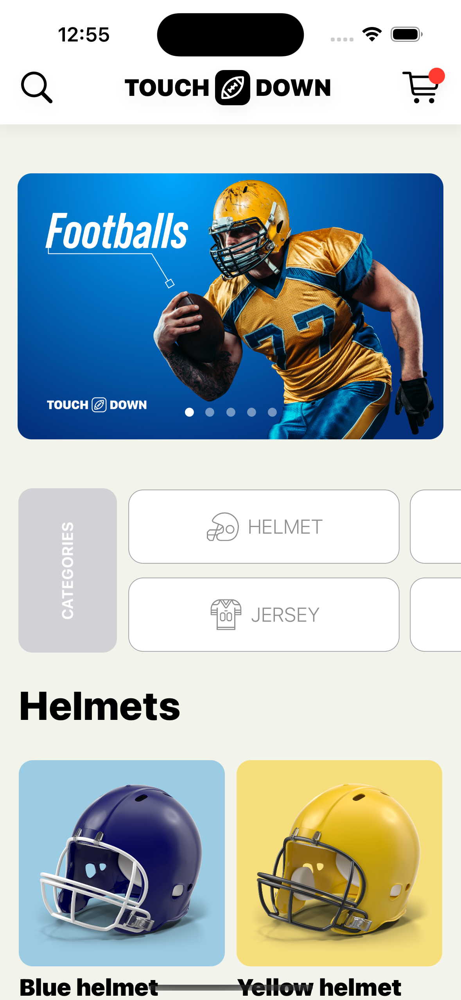
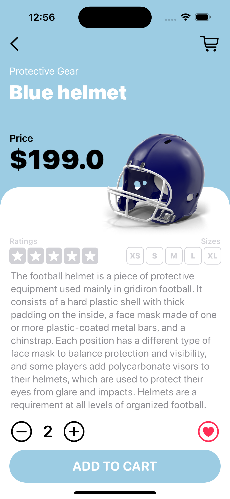

# Touchdown App

Let’s develop together a modern E-commerce mobile application with the SwiftUI framework. 
This time we are going to create a more realistic iOS 14 app prototype and covering some important programming concepts as well.

### Setup
This project was implemented using XCode 14 and iOS 15 deployment target.

## Summary

### LEARNING OBJECTIVES
#### - How to prototype an e-commerce mobile application,
#### - How the @Environment property wrapper works,
#### - How to use the Observable Object property wrapper,
#### - How to share the data model across the whole application with ease,
#### - How to store all constants in a separate Swift file,
#### - How to create a custom shape with Shape Path,
#### - How to use the horizontal grid layout in SwiftUI
#### - How to develop a custom navigation bar,
#### - How to proportionally resize the size of an item in the Page Tab view,
#### - How to optimize the app for different screen sizes,

# App screens

<table style="width:100%; border: 0px solid">
  <tr>
    <td></td>
    <td></td>
    <td></td>
  </tr
</table>

### End
