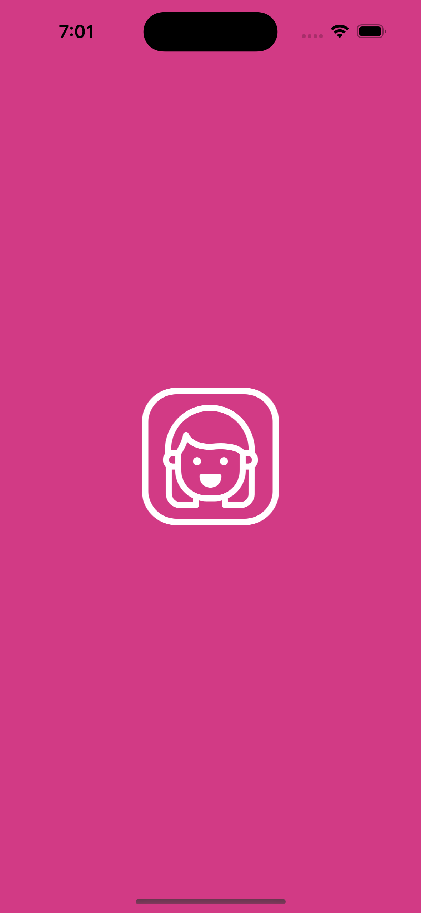
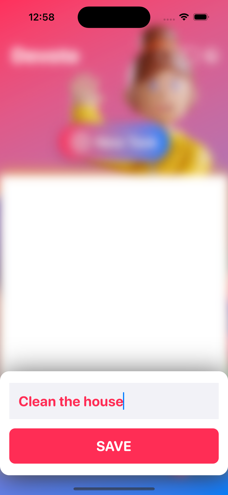

# Devote App

We will develop a task manager iOS application with Core Data integration.
This is not a project with a boring user interface.
This iOS and iPadOS application provides a personal touch and feel.

### Setup
This project was implemented using XCode 14 and iOS 15 deployment target.

## Summary

### LEARNING OBJECTIVES

#### - Integrate Core Data with the SwiftUI App Life Cycle
#### - Get familiar with Xcode's new Core Data template
#### - Create a basic Widget for iOS and iPadOS devices
#### - Develop a Widget sets with different sizes (small, medium, large)
#### - Set up the Preview to test the different Widget sizes on the Canva
#### - Create, Read, Update and Delete a database item (CRUD method)
#### - Show SwiftUI views conditionall
#### - Switch from Light mode to Dark mode the app's appearance
#### - Store the app's appearance using App Storage
#### - Create a visual effect with SwiftUI (blur, overlay, display mode)
#### - Add the required assets for the Widget extension
#### - Develop a custom Toggle style and make a checkbox
#### - Improve the User Experience with sound effects
#### - Practice how to use Apple's Feedback Generator and implement haptics

# App screens

<table style="width:100%; border: 0px solid">
  <tr>
    <td></td>
    <td></td>
    <td></td>
  </tr
</table>

### End
